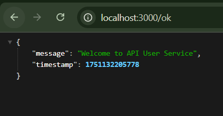
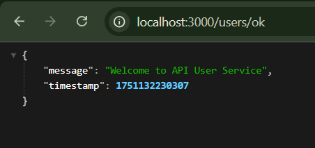
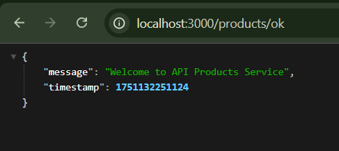

# 🧩 API Gateway Microservices Project

This project demonstrates a **microservices architecture** using a centralized **API Gateway**, built with **Node.js** and **Express.js**.

---

## 🔧 Services Overview

This project includes the following services:

- 🚪 **API Gateway** — routes all requests (Port `3000`)
- 👤 **User Service** — handles user operations (Port `3001`)
- 📦 **Product Service** — handles product operations (Port `3002`)

Each microservice contains basic endpoint logic and is independently runnable.

---

## 🌐 Service Ports

| Service         | Port             |
|-----------------|------------------|
| API Gateway     | `localhost:3000` |
| User Service    | `localhost:3001` |
| Product Service | `localhost:3002` |

---

## 📡 API Endpoints

All endpoints are accessible **via API Gateway** at `http://localhost:3000`.

### ✅ Health Check

- **Endpoint:** `GET /ok`
- **Description:** Verifies the API Gateway is operational.
- **Sample Response:**
  ```json
  {
    "message": "API Gateway is running"
  }


## 📡 API Endpoints

### ✅ Health Check

- **Method:** `GET /ok`
- **Description:** Verifies that the API Gateway is operational.
- **Response:**
  ```json
  {
    "message": "API Gateway is running"
  }

## Services

### 🧑 User Service

- **Runs on**: `localhost:3001`
- **Purpose**: Manages user-related operations (e.g., retrieving user data).
- **Access via Gateway**: `/users/`

### 📦 Product Service

- **Runs on**: `localhost:3002`
- **Purpose**: Manages product-related operations (e.g., retrieving product data).
- **Access via Gateway**: `/products/`

---

## 🛠️ Setup and Running

### Prerequisites

- Install **Node.js** (v16 or higher recommended).
- Install dependencies for each service.

## Testing the Endpoints

| Service         | Port                                |
|-----------------|-------------------------------------|
| API Gateway     | `http://localhost:3000/ok`          |
| User Service    | `http://localhost:3000/users/ok`    |
| Product Service | `http://localhost:3000/products/ok` |

##  Notes

The API Gateway serves as a single entry point, routing requests to the appropriate microservice.
Each service is independent and can be developed, deployed, or scaled separately.
Ensure all services are running concurrently for proper functionality.




