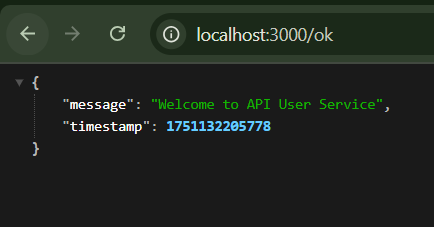
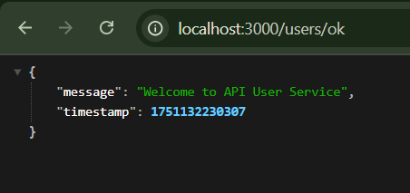
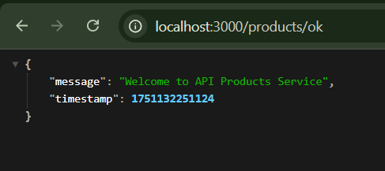

🧩 API Gateway Microservices Project
This project demonstrates a microservices architecture with a centralized API Gateway, developed using Node.js and Express. The project consists of:

🚪 API Gateway Service (Port: 3000)
👤 User Service (Port: 3001)
📦 Product Service (Port: 3002)

Each microservice has its own basic set of APIs. The API Gateway routes requests to the appropriate service.
Services and Ports

API Gateway: localhost:3000
User Service: localhost:3001
Product Service: localhost:3002

API Endpoints
API Gateway

Health Check

GET /ok
Description: Verifies the API Gateway is operational.
Response: Status message indicating the gateway is running.

Users

GET /users/
Description: Fetches a list of users by routing to the User Service.
Response: JSON array of user data.

Products

GET /products/
Description: Fetches a list of products by routing to the Product Service.
Response: JSON array of product data.

User Service

Runs on localhost:3001
Manages user-related operations (e.g., retrieving user data).
Accessible via the API Gateway at /users/.

Product Service

Runs on localhost:3002
Manages product-related operations (e.g., retrieving product data).
Accessible via the API Gateway at /products/.

Setup and Running

Prerequisites

Install Node.js (v16 or higher recommended).
Ensure all dependencies are installed for each service (npm install in each service directory).

Starting the Services

API Gateway:cd api-gateway
npm start

Runs on localhost:3000

User Service:cd user-service
npm start

Runs on localhost:3001

Product Service:cd product-service
npm start

Runs on localhost:3002

Testing the Endpoints

Use tools like Postman or curl to test:curl http://localhost:3000/ok
curl http://localhost:3000/users/
curl http://localhost:3000/products/

Project Structure
project-root/
├── api-gateway/
│   └── (API Gateway code and configuration)
├── user-service/
│   └── (User Service code and configuration)
├── product-service/
│   └── (Product Service code and configuration)
└── README.md

Notes

The API Gateway serves as a single entry point, routing requests to the appropriate microservice.
Each service is independent and can be developed, deployed, or scaled separately.
Ensure all services are running concurrently for proper functionality.

